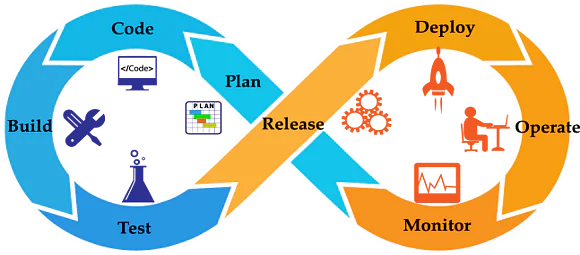
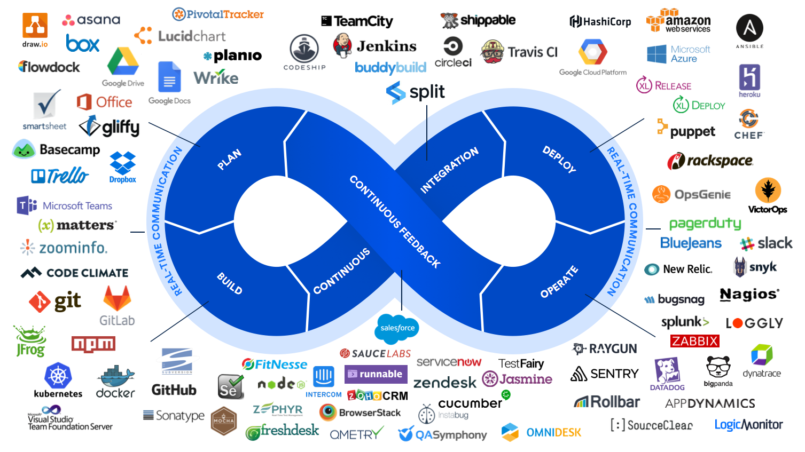

# Top 60 DevOps Interview Questions and Answers
Here, you will come across 
some of the most popularly asked questions in this field to 
prepare for real-world job interviews. Following are a few of 
the common DevOps questions that recruiters ask during job 
interviews.

- What is DevOps?
- How does HTTP work?
- In terms of development and infrastructure, mention the core operations of DevOps.
- What is DevOps? Is it a tool?

This DevOps Interview Questions and Answers blog is divided largely into the following three categories:

- [Basic DevOps Interview Questions](#basic-devops-interview-questions)
- [Intermediate DevOps Interview Questions](#intermediate-devops-interview-questions)
- [Advanced DevOps Interview Questions](#advanced-devops-interview-questions)

# Basic DevOps Interview Questions
## 1. What is DevOps?
| Characteristics   | DevOps                                                                               |
| ----------------- | ------------------------------------------------------------------------------------ |
| Basic premise     | A collaboration of development and operations teams. It is more of a cultural shift. |
| Related to        | Agile methodology                                                                    |
| Priorities        | Resource management, communication, and teamwork                                     |
| Benefits          | Speed, functionality, stability, and innovation                                      |

## 2. How does HTTP work?
HTTP or Hypertext Transfer Protocol works in a client–server model like the most other protocols. HTTP provides a way to interact with web resources by transmitting hypertext messages between clients and servers.
<a>  
    <p align="center"></p>
</a>

## 3. In terms of development and infrastructure, mention the core operations of DevOps.
Core operations of DevOps include:

- Development
- Version Control
- Testing
- Integration
- Deployment
- Delivery
- Configuration
- Monitoring
- Feedback

## 4. What are some technical and business benefits of DevOps work culture?
Technical benefits:

- Continuous software delivery
- Less complex problems to fix
- Faster bug resolution

Business benefits:

- Faster delivery of features for customer satisfaction
- More stable operating environments
- More time available to add product value

## 5. Name some of the most important DevOps tools?
- Git
- Maven
- Selenium
- Jenkins
- Docker
- Puppet
- Chef
- Ansible
- Nagios
- ......

## 6. What is CI? What is its purpose?
CI or Continuous Integration is the process of compiling the entire code base, every time a member of the software development team checks the code, into the shared source code repository.
<a>  
    <p align="center"></p>
</a>
If a team member checks into the code file with a bug, then the build gets broken. In this sort of scenario, other developers can’t synchronize the shared source code repository without introducing compilation errors into their own local workspaces. Thus, collaborative and shared software development cannot go forward.

When a CI build breaks, it is crucial that the problem is corrected immediately. A CI process often includes a suite of unit, and integration and regression tests that run every time the compilation succeeds. If any of these tests fail, the build will be considered unstable, not broken.

## 7. Name three important DevOps KPIs.
Three of the most common DevOps KPIs are:
```diff
+ Meantime to failure recovery
+ Deployment frequency
+ Percentage of failed deployments
```

## 8. What is the difference between continuous deployment and continuous delivery?
Continuous deployment is fully automated, and the deployment to production needs no manual intervention in continuous deployment; whereas, in continuous delivery, the deployment to production requires some manual intervention for change management in the organization, and it needs to be approved by the manager or higher authorities to be deployed in production. According to your organization’s application risk factor, continuous deployment/delivery approach will be chosen.
<a>  
    <p align="center"></p>
</a>

## 9. What is DevOps? Is it a tool?
DevOps can’t be referred to as a tool , it is a collaborative work culture that combines development and operations teams for continuous development, continuous testing, continuous integration, continuous deployment, and continuous monitoring.

## 10. What are the core operations of DevOps in terms of development and infrastructure?
The core operations of DevOps are application development, version control, unit testing, deployment with infrastructure, monitoring, configuration, and orchestration.

## 11. Our team has some ideas and wants to turn those ideas into a software application. Now, as a manager, I am confused about whether I should follow the Agile work culture or DevOps. Can you tell me why I should follow DevOps over Agile?
According to the current market trend, instead of releasing big sets of features in an application, companies are launching small features for software with better product quality and quick feedback from customers, for high customer satisfaction. Now, to keep up with this, we have to:

- Increase the deployment frequency in the safest and reliable way
- Lower the failure rate of new releases
- Shorten the bug resolution time

DevOps fulfills all these requirements for fast and reliable development and deployment of software. Companies like Amazon and Google have adopted DevOps and are launching thousands of code deployments per day. But Agile, on the other hand, only focuses on the development of software.

## 12. Can one consider DevOps as an Agile methodology?
DevOps can be considered as complementary to the Agile methodology but not completely similar.

## 13. Can you tell me the advantages of using Git?
- Data redundancy and replication
- High availability
- Only one Git directory per repository
- Superior disk utilization and network performance
- Collaboration friendly
- Can be used for any sort of projects

## 14. Are git fetch and git pull the same?
The command `git pull` pulls any new commits from a branch from the central repository and then updates the target branch in the local repository.

But, `git fetch` is a slightly different form of `git pull`. Unlike `git pull`, it pulls all new commits from the desired branch and then stores them in a new branch in the local repository.

In order to reflect these changes in your target branch, `git fetch` must be followed with a `git merge`. The target branch will only be updated after merging with the fetched branch (where we performed `git fetch`). We can also interpret the whole thing with an equation like this:
```bash
  git pull = git fetch + git merge
```

## 15. What are the benefits of using version control?
- **It helps improve the collaborative work culture:** Here, team members are allowed to work freely on any file at any time. The version control system allows us to merge all changes into a common version.
- **It keeps different versions of code files securely:** All the previous versions and variants of code files are neatly packed up inside the version control system.
- **It understands what happened:** Every time we save a new version of our project, the version control system asks us to provide a short description of what was changed. More than that it allows us to see what changes were made in the file’s content, as well as who has made those changes.
- **It keeps backup:** A distributed version control system like Git allows all team members to have the complete history of the project file so that in case there is a breakdown in the central server, they can use any of their teammate’s local Git repository.

# Intermediate DevOps Interview Questions
## 16. How do you handle the merge conflicts in Git?
In order to resolve the merge conflicts in Git, we need to follow three steps:

- **Understand what happened:** It could be because of the same line edit on the same file; it could be because of deleting some files, or also it could be because of files with the same file names. You can check everything by using `git status`.
- **Mark and clean up the conflict:** When we open the files using the **merge tool**, Git marks the conflicted area like this ‘<<<<< HEAD’ and ‘ >>>>> [other/branch/name]’.
- **Perform commit** again and then merge the current branch with the master branch.

## 17. Can you tell me some advantages of Forking Workflow over other Git workflows?
Forking Workflow is fundamentally different from other Git workflows. Instead of using a single server-side repository to act as the ‘central’ codebase, Forking Workflow gives every developer their own server-side repositories. This workflow is most often seen in public open-source projects.

The main advantage is that contributions can be integrated without the need for everyone to push to a single central repository to maintain clean project history. Developers can push to their own server-side repositories, and only the project maintainer will push to the official repository.

As soon as developers are ready to publish their local commits, they will push their commits to their own public repositories. Then, they will perform a pull request from the main repository, which notifies the project maintainer that an update is ready to be integrated.

## 18. When do you use `git rebase` instead of `git merge`?
Both `git rebase` and `git merge` commands are designed to integrate changes from one branch into another branch: just that they just do it in different ways.

When we perform rebase of a feature branch onto the master branch, we move the base of the feature branch to the master branch’s ending point.

By performing a merge, we take the contents of the feature branch and integrate them with the master branch. As a result, only the master branch is changed, but the feature branch history remains the same. Merging adds a new commit to your history.

Rebasing will create inconsistent repositories. For individuals, rebasing makes a lot of sense. Now, in order to see the history completely, the same way as it has happened, we should use merge. Merge preserves history, whereas rebase rewrites it.

## 19. I just made a bad git commit and made it public, and I need to revert the commit. Can you suggest me how to do that?
Here we can use the **Git command**:
```
git revert <name the commit you wish to revert>
```
This command is very helpful because we can revert any commands just by adding the commit ID.

## 20. Can you tell me how to squash the last n commits into a single commit? Is it even possible?
To squash the last n commits into a single commit, we can use:
```
git reset -- soft HEAD~n &&
git commit
```

## 21. I want to move or copy Jenkins from one server to another. Is it possible? If yes, how?
I would suggest copying the Jenkins jobs directory from the old server to the new one. We can just move a job from one installation of Jenkins to another by just copying the corresponding job directory.

Or, we can also make a copy of an existing Jenkins job by making a clone of that job directory in a different name.

Another way is that we can rename an existing job by renaming the directory. But, if you change the name of a job, you will need to change any other job that tries to call the renamed job.

## 22. Can you tell me, what Continuous Testing and Automation Testing are?
Automation testing, as the name suggests, is a process of automating the manual process of testing. It involves the use of separate testing tools that let developers create test scripts that can be executed repeatedly without any manual intervention.
<a>  
    <p align="center"></p>
</a>
Continuous testing is nothing but the process of executing automated tests as part of the software delivery pipeline in DevOps. In this process, each build is tested continuously, allowing the development team to get fast business feedback so that it can prevent the problems from progressing to the next stage of the software delivery lifecycle. This will dramatically speed up a developer’s workflow. He/she no longer needs to manually rebuild the project and re-run all tests after making changes.
<a>  
    <p align="center"></p>
</a>

## 23. How to launch a browser using WebDriver?
For Firefox:
```
WebDriver driver = new FirefoxDriver();
```
For Chrome:
```
WebDriver driver = new ChromeDriver();
```
For Internet Explorer (IE):
```
WebDriver driver = new InternetExplorerDriver();
```

## 24. Are there any technical challenges with Selenium?
- It supports only web-based applications.
- It does not support the Bitmap comparison.
- No vendor support is available for Selenium compared to commercial tools like HP UFT.
- As there is no object repository concept, maintainability of objects becomes very complex.

## 25. When should I use Selenium Grid?
It can be used to execute the same or different test scripts on multiple platforms and browsers, concurrently, in order to achieve distributed test execution. It allows testing under different environments, remarkably saving the execution time.

## 26. Describe the difference between driver.close() and driver.quit().
The driver.close command closes the focused browser window. But, the driver.quit command calls the driver.dispose method which closes all browser windows and also ends the WebDriver session.

## 27. I have 40 jobs in the Jenkins dashboard and I need to build them all at once. Is it possible?
Yes, it is. With the help of a Jenkins plugin, we can build projects one after the other. If one parent job is carried out, then automatically other jobs are also run. We also have the option to use Jenkins Pipeline jobs for the same.

## 28. How will you secure Jenkins?
The way to secure Jenkins is as follows:

- Ensure that the global security is on
- Check whether Jenkins is integrated with the company’s user directory with an appropriate plugin
- Make sure that Project matrix is enabled to fine-tune access
- Automate the process of setting rights or privileges in Jenkins with a custom version-controlled script
- Limit physical access to Jenkins data or folders
- Periodically run security audits

## 29. Can you please tell me how to create a backup and copy files in Jenkins?
To create a backup, all we need to do is to periodically back up our JENKINS_HOME directory. This contains all of the build configurations of our job, our slave node configurations, and our build history. To create a backup of our Jenkins setup, just copy this directory. We can also copy a job directory to clone or replicate a job or rename the directory.

## 30. What is Jenkins Pipeline and CI/CD Pipeline?
Jenkins Pipeline can be defined as a suite of plugins supporting both implementation and integration of Jenkins continuous delivery pipeline.
<a>  
    <p align="center"></p>
</a>
Continuous integration or continuous delivery pipeline consists of build, deploy, test, and release. The pipeline feature is very time-saving. In other words, a pipeline is a group of build jobs that are chained and integrated in a sequence.

## 31. What are Puppet Manifests?
Every Puppet Node or Puppet Agent has got its configuration details in Puppet Master, written in the native Puppet language. These details are written in a language that Puppet can understand and are termed as Puppet Manifests. These manifests are composed of Puppet codes, and their filenames use the .pp extension.

For instance, we can write a manifest in Puppet Master that creates a file and installs Apache on all Puppet Agents or slaves that are connected to the Puppet Master.

## 32. How can I configure systems with Puppet?
In order to configure systems with Puppet in a client or server architecture, we have to use the Puppet Agent and the Puppet Master applications. In a stand-alone architecture, we have to use the Puppet apply application.

## 33. What is a Puppet Module? How is it different from the Puppet Manifest?
A Puppet Module is nothing but a collection of manifests and data (e.g., facts, files, and templates). Puppet Modules have a specific directory structure. They are useful for organizing the Puppet code because with Puppet Modules we can split the Puppet code into multiple manifests. It is considered as the best practice to use Puppet Modules to organize almost all of your Puppet Manifests.

Puppet Modules are different from Puppet Manifests. Manifests are nothing but Puppet programs, composed of the Puppet code. File names of Puppet Manifests use the .pp extension.

## 34. Can you tell me what a Puppet codedir is?
It is the main directory for code and data in Puppet. It consists of environments (containing manifests and modules), a global modules directory for all the environments, and your Hiera data.

## 35. Where do you find codedir in Puppet?
It is found at one of the following locations:

Unix/Linus Systems:
```
/etc/puppetlabs/code
```
Windows:
```
%PROGRAMDATA%\PuppetLabs\code (usually C:\ProgramData\PuppetLabs\code)
```
Non-root users:
```
~/.puppetlabs/etc/code
```

# Advanced DevOps Interview Questions

## 36. How does Ansible work?
Ansible is an open-source automation tool, which is categorized into two types of servers:

Controlling machines
Nodes
Ansible will be installed on the controlling machine, and using that machine nodes are managed with the help of SSH. Nodes’ locations are specified by inventories in that controlling machine.

Since Ansible is an agentless tool, it doesn’t require any mandatory installations on remote nodes. So, there is no need of background programs to be executed while it is managing any nodes.

Ansible can handle a lot of nodes from a single system over an SSH connection with the help of Ansible Playbooks. Playbooks are capable of performing multiple tasks, and they are in the YAML file format.

## 37. Sometimes, we use ad-hoc commands instead of Playbooks in Ansible. Can you tell me what’s the difference between Ansible Playbook and an ad-hoc command? Also, cite when to use them.
Ad-hoc commands are used to do something quickly, and they are for, mostly, one-time use. Whereas, Ansible Playbook is used to perform repeated actions. There are scenarios where we want to use ad-hoc commands simply to perform a non-repetitive activity.

## 38. Why should I use Ansible?
Ansible can help in:

- Configuration Management
- Application Deployment
- Task Automation

## 39. What are handlers in Ansible?
Handlers in Ansible are just like regular tasks inside an Ansible Playbook, but they are only run if the task contains a ‘notify’ directive. Handlers are triggered when it is called by another task.

## 40. Have you heard about Ansible Galaxy? What does it do?
Yes, I have. Ansible Galaxy refers to the `Galaxy website` by Ansible, where users share Ansible roles. It is used to install, create, and manage Ansible roles.

## 41. Can you write the syntax for building a docker image?
To build a docker image, we use the following command:
```
docker build –f <file_name> -t image_name:version
```

## 42. What is the concept of sudo in Linux?
Sudo is a program for Unix/Linux-based systems that provides the ability to allow specific users to use specific system commands in the system’s root level. It is an abbreviation of `superuser do`, where `super user` means the `root user`.

## 43. Can you tell me the purpose of SSH?
SSH is nothing but a secure shell that allows users to login with a secure and encrypted mechanism into remote computers. It is used for encrypted communications between two hosts on an unsafe network. It supports tunneling, forwarding TCP, and also transferring files.

## 44. What is NRPE in Nagios?
NRPE stands for `Nagios Remote Plugin Executor`. As the name suggests, it allows you to execute Nagios plugins remotely on other Linux or Unix machines.
It can be helpful in monitoring remote machine performance metrics such as disk usage, CPU load, etc. It can communicate with some of the Windows agent add-ons. We can execute scripts and check metrics on remote Windows machines as well.

## 45. Can you tell me why I should use Nagios?
- To plan for infrastructure upgrades before the outdated systems fail
- To respond to issues quickly
- To fix problems automatically when detected
- To coordinate with the responses from the technical team
- To ensure that the organization’s service-level agreements with the clients are being met
- To make sure that the IT infrastructure outages have only a minimal effect on the organization’s net income
- To monitor the entire infrastructure and business processes

## 46. What is Nagios Log Server?
Nagios Log Server simplifies the process of searching the log data. Nagios Log Server is the best choice to perform tasks such as setting up alerts, notifying when potential threats arise, simply querying the log data, and quickly auditing any system. With Nagios Log Server, we can get all of our log data in one location with high availability.
<a>  
    <p align="center"></p>
</a>

## 47. Can you tell me why I should use Nagios for HTTP monitoring?
Nagios can provide us the complete monitoring service for our HTTP servers and protocols. Here are a few benefits of implementing effective HTTP monitoring with Nagios:

- Server, services, and application availability can be increased.
- Network outages and protocol failures can be detected quickly.
- User experience can be monitored.
- Web server performance can be monitored.
- Web transactions can be monitored.
- URLs can be monitored.

## 48. What is a namespace in Kubernetes?
Namespaces are a way to divide cluster resources between multiple users in Kubernetes. In other words, it is useful when multiple teams or users are using the same cluster which can lead to potential name collision.

## 49. What is kubectl?
By definition, kubectl is a command-line interface for running commands against Kubernetes clusters. Here, `ctl` stands for `control`. This `kubectl` command-line interface can be used to deploy applications, inspect and manage cluster resources, and view logs.

## 50. What are the testing types supported by Selenium?
Selenium supports regression testing and functional testing.

## 51. What are the prerequisites to install Ansible 2.8 on Linux?
To install Ansible 2.8 on Linux, Security-Enhanced Linux (SELinux) has to be enabled and Python 3 has to be installed on remote nodes.

## 52. What is the role of configuration management in DevOps?
The major advantages of configuration management are given below:

- It enables us to manage the configurations on multiple systems.
- It allows us to standardize the configurations on all systems in a cluster.
- It helps us in the administration and management of multiple servers in the architecture.

## 53. What is the role of AWS in DevOps?
AWS in DevOps works as a  cloud provider, and it has the following role in DevOps:
<a>  
    <p align="center"></p>
</a>
- Flexible services: AWS provides us with ready-to-use resources for implementation.
- Scaling purpose: We can deploy thousands of machines on AWS, depending on the requirement.
- Automation: AWS helps us automate tasks using various services.
- Security: Using its security options (IAM), we can secure our deployments and builds.

## 54. Which file is used to define dependency in Maven?
In Maven, we define all dependencies inside pom.xml so that all the dependencies will be downloaded and can be used within the project.

## 55. What are the benefits of using the version control system (VCS)?
- VCS allows developers to merge the changes that are made in the same version.
- It allows them to share files easily between multiple computers.
- The complete history of the project is visible to all the developers so that they can use the previous version if there is any breakdown.
- All the versions are packed up so that they can easily re-use them.

## 56. What are the benefits of Ansible?
Ansible is an open-source configuration management tool that helps us in the following:

- Automating tasks
- Managing configurations
- Deploying applications
- Efficiency

## 57. Explain the different Selenium components.
Following are the different components of Selenium:

- **Selenium Integrated Development Environment (IDE)** – The Selenium IDE consists of a simple framework and comes with a Firefox plug-in that can be easily installed. This Selenium component should be used for prototyping.
- **Selenium Remote Control (RC)** – It is a testing framework for developers and QA that supports coding in any programming language like Java, PHP, C#, Perl, etc. This helps automate the UI testing process of web applications against any HTTP website.
- **Selenium WebDriver** – It has a better approach to automating the testing process of web-based applications and does not rely on JavaScript. This web framework allows cross-browser tests to be performed.
- **Selenium Grid** – This proxy server works with Selenium RC and with the help of browsers, it is able to run parallel tests on different nodes or machines.

## 58. What are the advantages of Docker over virtual machines?
Below are the differences in multiple criteria that show why Docker has advantages over virtual machines.

**Memory Space** – In terms of memory, Docker occupies lesser space than a virtual machine.
**Boot-up Time** – Docker has a shorter boot-up time than a virtual machine.
**Performance** – Docker containers show better performance as they are hosted in a single Docker engine, whereas, performance is unstable if multiple virtual machines are run.
**Scaling** – Docker is easy to scale up compared to virtual machines.
**Efficiency** – The efficiency of docker is higher, which is an advantage over virtual machines.
**Portability** – Docker doesn’t have the same cross-platform compatibility issues with porting as virtual machines do.
**Space Allocation** – Data volumes can be shared and used repeatedly across multiple containers in Docker, unlike virtual machines that cannot share data volumes.

## 59. Why are SSL certificates used in Chef?
SSL certificates are required between the client and the Chef server to ensure that the right data is accessible by each node. When an SSL certificate is sent to the server, the public key pair of each node is stored at the Chef server. The server then compares this against the public key for the identification of the node and gives it access to the required data.

## 60. How can Docker containers be shared with different nodes?
<a>  
    <p align="center"></p>
</a>
Docker containers can be shared on different nodes with the help of the Docker Swarm. IT developers and administrators use this tool for the creation and management of a cluster of swarm nodes within the Docker platform. A swarm consists of a worker node and a manager node.